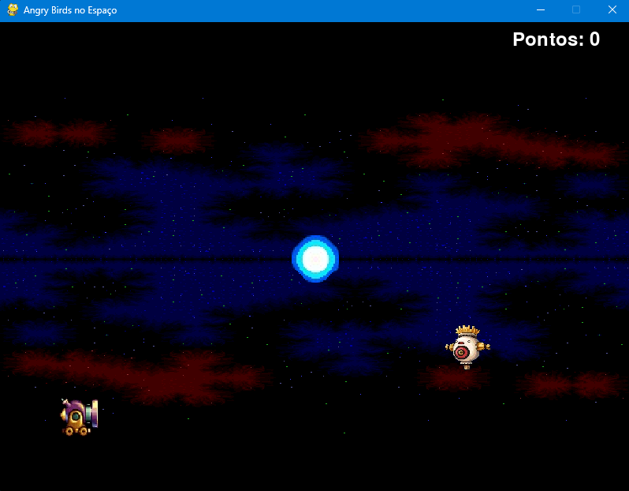

# Angry-Bids-do-Espaço

Esse é um jogo simples desenvolvido em Python ultilizando a biblioteca Pygame. O objetivo do jogo é lançar projéteis de um canhão em direção a um alvo, enquanto corpos celestes no espaço exercem forças gravitacionais que afetam a trajetória dos projéteis e alvo.

## Índice

- [Instalação](#instalação)
- [Como jogar](#como-jogar)
- [Controles](#controles)
- [Recursos Utilizados](#recursos-utilizados)
- [Estrutura do Código](#estrutura-do-código)
- [Contribuição](#contribuição)

## Instalação
Para rodar o jogo, você precisará ter o Python 3.x instalado em sua máquina, além da biblioteca Pygame. Siga os passos abaixo para instalar o Pygame:

'''bash
pip install pygame

Em seguida, clone este repositório ou baixe os arquivos do projeto para o seu computaodr.

## Como jogar
O objetivo do jogo é acertar o alvo em cada nível. O alvo pode se mover e há corpos celestes que exercem força gravitacional sobre os projéteis. Quando todos os níveis são completados, o jogo termina.

## Controles
- Mouse: Controle o ângulo do canhão movendo o mouse.
- Botão Esquerdo do Mouse: Mantenha pressionado para aumentar a potência do disparo. Solte para disparar o projétil.
- Esc: Fecha o jogo.

## Recursos Ultilizados
### Texturas
- 'background.png': Textura do fundo do jogo.
- 'cannon.png': Textura do canhão.
- 'projectile.png': Textura do projétil.
- 'target.png': Textura do alvo.
- 'celestial.png': Textura dos corpos celestes.

### Sons
- 'satriani.mp3': Trilha sonora do fundo do jogo (Música do guitarrista Joe Satriani).
- 'shot_sound.wav': Efeito sonoro para o disparo do canhão.
- 'hit_sound.wav': Efeito sonoro para quando o alvo é atingido.

### Código
O código do jogo está estruturado em várias classes:
- Projectile: Representa os projéteis disparados pelo canhão.
- Target: Representa o alvo a ser atingido em cada nível.
- CelestialBody: Representa corpos celestes que exercem força gravitacional.
- game_loop: A função principal que roda o loop do jogo.

## Estrutura do Código
- cannon_pos: Posição inicial do canhão.
- cannon_angle: Ângulo de disparo do canhão.
- cannon_power: Potência do disparo.
- gravity: Gravidade global aplicada aos projéteis
- score: Variável que armazena a pontuação do jogador.

## Contribuição
Contribuições são bem-vindas! Sinta-se à vontade para abrir issues ou enviar pull requests com melhorias, correções de bugs ou novos recursos.
